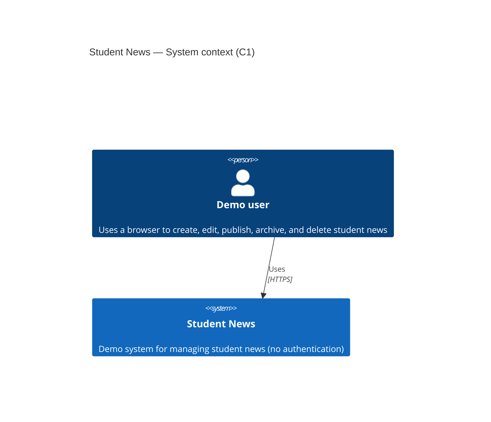
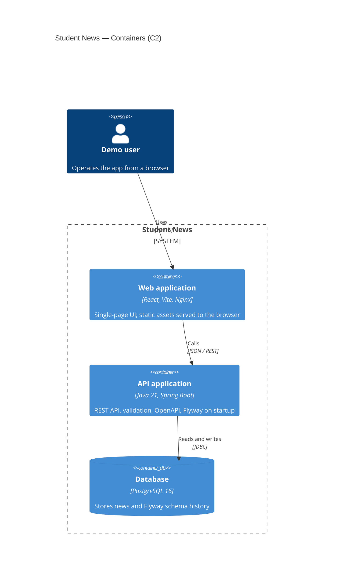
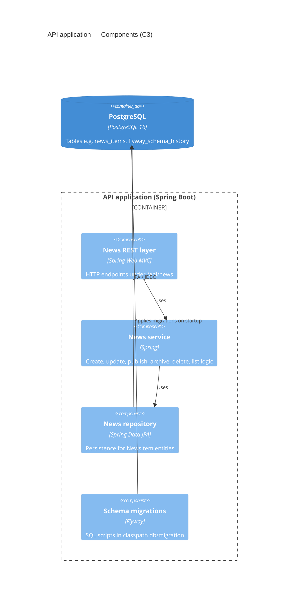
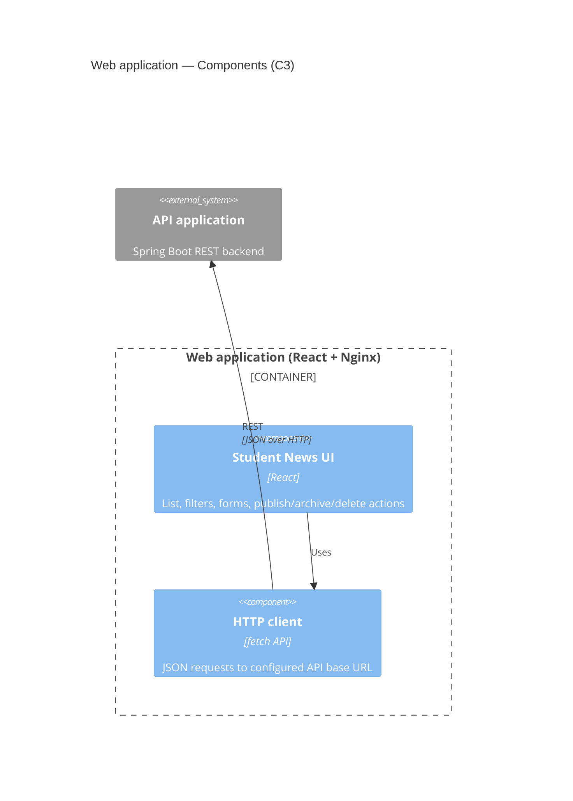

# Student News Demo

Demo application for managing student news without authentication.

Supported operations:
- list news
- create news drafts
- edit existing news
- publish news
- archive news
- delete news

---

## Architecture

The solution follows the [C4 model](https://c4model.com/) at **context (C1)**, **container (C2)**, and **component (C3)** levels. Diagrams use [Mermaid C4 syntax](https://mermaid.js.org/syntax/c4.html) (experimental in some renderers; use a recent Mermaid-compatible viewer if a diagram does not render).

**C1 — System context:** who uses the system and what the system is responsible for, without internal technology.

**C2 — Containers:** runnable/deployable units (web app, API, database) and how they communicate.

**C3 — Components:** major building blocks *inside* each container (here: backend Spring Boot and frontend React).

### C1 — System context



### C2 — Containers



Local deployment: **Docker Compose** builds and runs these three containers together (see `docker-compose.yml`).

### C3 — Components (backend: API application)



### C3 — Components (frontend: web application)



---

## Tech stack

- PostgreSQL 16
- Java 21 + Spring Boot 3
- Spring Data JPA + Hibernate
- React 18 + Vite
- Docker + Docker Compose

---

## Project structure

```text
.
├── backend/              # Spring Boot API
├── frontend/             # React UI
└── docker-compose.yml    # Local deployment
```

---

## Prerequisites

- Docker Desktop installed and running
- Docker Compose v2 (`docker compose`)

---

## Quick start

From the project root:

```bash
docker compose up --build
```

When containers are ready:

- Frontend: [http://localhost:5173](http://localhost:5173)
- Backend API: [http://localhost:8080/api/news](http://localhost:8080/api/news)
- Swagger UI: [http://localhost:8080/swagger-ui/index.html](http://localhost:8080/swagger-ui/index.html)
- OpenAPI JSON: [http://localhost:8080/v3/api-docs](http://localhost:8080/v3/api-docs)
- PostgreSQL: `localhost:5432`

Stop everything:

```bash
docker compose down
```

Stop and remove DB volume (clean reset):

```bash
docker compose down -v
```

---

## API

Base URL: `http://localhost:8080/api/news`

OpenAPI specification is auto-generated from code and available at:
- `GET /v3/api-docs` (JSON)
- Swagger UI: `/swagger-ui/index.html`

### Endpoints

- `GET /api/news` - list all news
- `GET /api/news?status=DRAFT|PUBLISHED|ARCHIVED` - list by status
- `POST /api/news` - create draft news
- `PUT /api/news/{id}` - edit news title/content
- `PATCH /api/news/{id}/publish` - mark as published
- `PATCH /api/news/{id}/archive` - mark as archived
- `DELETE /api/news/{id}` - delete news

### Create/update payload

```json
{
  "title": "Exam schedule announced",
  "content": "The exam period starts on June 3."
}
```

### Example requests

Create draft:

```bash
curl -X POST http://localhost:8080/api/news \
  -H "Content-Type: application/json" \
  -d '{"title":"Campus open day","content":"Open day starts at 10:00"}'
```

Publish news with id `1`:

```bash
curl -X PATCH http://localhost:8080/api/news/1/publish
```

Archive news with id `1`:

```bash
curl -X PATCH http://localhost:8080/api/news/1/archive
```

Delete news with id `1`:

```bash
curl -X DELETE http://localhost:8080/api/news/1
```

---

## Database configuration

Default DB settings used by Docker Compose:

- database: `student_news`
- user: `student`
- password: `student`

The backend reads:

- `SPRING_DATASOURCE_URL`
- `SPRING_DATASOURCE_USERNAME`
- `SPRING_DATASOURCE_PASSWORD`

---

## Database migrations (Flyway)

Schema changes are managed with Flyway SQL migrations.

- migration folder: `backend/src/main/resources/db/migration`
- naming format: `V{number}__{description}.sql`
- example: `V2__add_news_summary_column.sql`

Current setup:
- Flyway runs automatically on backend startup
- Hibernate uses `validate` mode (it validates schema, but does not create/update tables)

To add a new migration:
1. Create a new SQL file in `db/migration` with next version number.
2. Put DDL/DML changes in this file.
3. Rebuild/restart backend (`docker compose up --build`).

If you already have a non-empty database without Flyway history, `baseline-on-migrate=true` is enabled for easier local onboarding.

---

## Notes

- This project is intentionally simple and does **not** include authentication/authorization.
- It is designed for demo and local development purposes.

---

## Functional requirements (BDD)

BDD scenarios are documented in separate files:

- [API testing scenarios (BDD)](docs/api-testing-scenarios-bdd.md)
- [Frontend user scenarios (BDD)](docs/frontend-user-scenarios-bdd.md)
